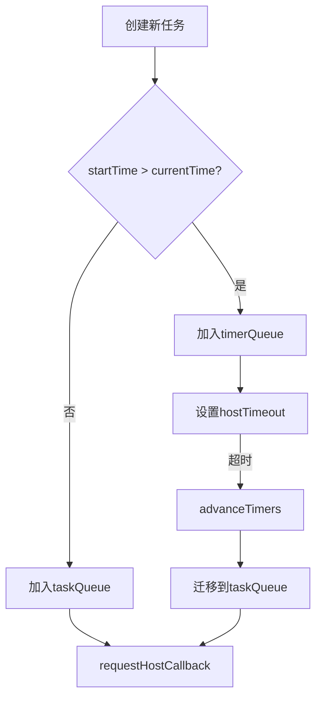
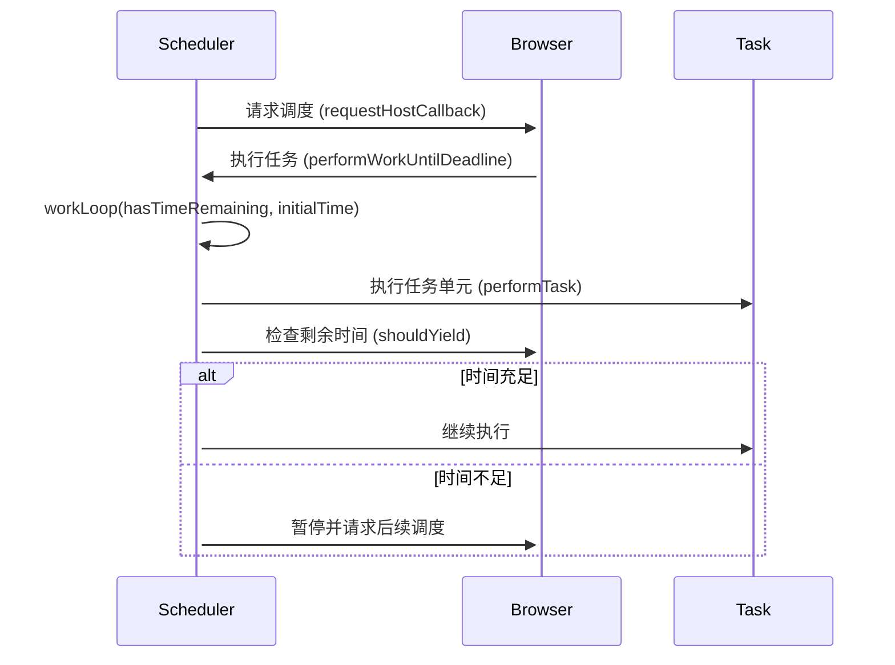
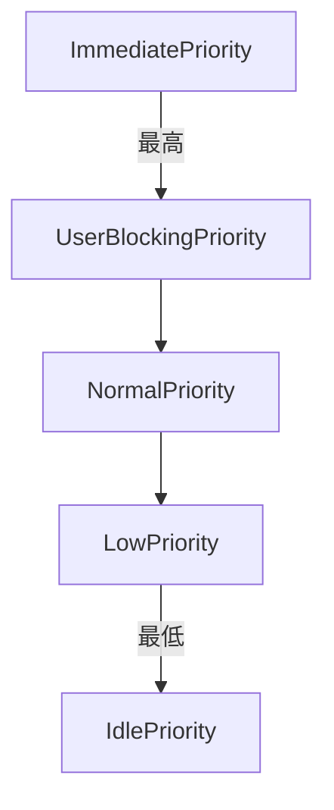

# 引言
在浏览器单线程模型中，JavaScript 执行、垃圾回收（GC）、用户交互响应与 UI 渲染**竞争同一主线程资源**。用户屏幕以 60Hz 刷新率运行时，主线程必须在 16.6ms 内完成每帧渲染任务——一旦 JavaScript 执行超时，将触发**渲染帧丢失（Dropped Frames）**，导致页面卡顿甚至交互冻结。
React 作为数据驱动型 UI 框架，面临核心挑战：
1. **资源瓶颈**：组件树深度遍历（如万级节点 diff）可能阻塞主线程
2. **优先级冲突**：用户交互（点击/输入）需即时响应，数据加载可延迟
3. **任务竞争**：渲染更新与 JS 逻辑共享有限计算资源
为了解决这些问题，React 设计实现了一个调度系统和优先级模型，核心思路是通过**时间切片**来将长任务拆分成多个小任务执行，避免阻塞渲染帧，此外基于**优先级模型**对任务根据紧急程度来设置优先级，以便优先处理紧急的任务，如用户输入。
# 调度系统的实现
## 抽象接口
React 作为构建用户界面的 JavaScript 库，其协调器（Reconciler）需要处理诸如状态更新、组件挂载/卸载、副作用执行等多样化的任务。这些任务虽然在触发场景和执行逻辑上存在显著差异，但 React 并未为每类任务单独设计调度逻辑，而是将任务抽象成一个特定的 Task 接口，**所有需要被调度系统执行的任务都需要符合该接口的规范。**
```typescript
type Task = {
  id: number, // 任务唯一标识
  callback: Callback | null, // 回调
  priorityLevel: PriorityLevel, // 优先级
  startTime: number, // 计划开始时间
  expirationTime: number, // 过期时间
  sortIndex: number, // 在任务队列中排序使用，timerQueue取自startTime，taskQueue取自expirationTime
  isQueued?: boolean, // 是否已经在任务队列中
};
```

我们称实现 Task 接口的 js 对象为 task，task 是调度系统的最小调度单元。从 Task 可以看出，每个 task 都有一个 id、callback、priorityLevel、startTime 等字段，每个字段都有各自的作用，例如调度系统执行 task 最终执行的其实是 `task.callback`, priorityLevel 记录了该 task 的优先级。
## 双任务队列设计与最小堆
### 优先级队列
现代前端框架的调度系统需要统筹异步任务的优先级与执行时机。传统单队列（FIFO）结构无法满足差异化调度需求，因此主流方案采用**优先级队列** （Priority Queue）实现任务排序。React 调度器在此基础上创新性地引入**双队列架构** ，通过两个基于小顶堆（Min-Heap）实现的优先级队列协同工作：
- **taskQueue** （立即执行队列）：存储已就绪的高优任务（如用户交互），基于**过期时间** （expirationTime）排序。过期时间越早（数值越小），优先级越高，队列顶部始终是当前最紧急任务
- **timerQueue** （延迟执行队列）：存储尚未就绪的低优任务（如数据预加载），基于**计划时间** （startTime）排序。计划时间越早（数值越小），触发调度的时机越快
当任务被创建时，React会根据 `task.startTime` 来决定存储到哪个队列中:
- 若 `task.startTime>currentTime`，低优先任务，存储到 timerQueue 延后执行。
- 若 `task.startTime<=currentTime`，高优先级任务，存储到 taskQueue 尽快执行。
**React 调度系统只会执行 taskQueue 中的任务，并且会不时地检查 timerQueue 队列，如果有 `task.startTime<=currentTime` 的任务，会被提升到 taskQueue 队列中。**

```typescript
function advanceTimers(currentTime: number) {
  // 检查timerQueue是否有过期任务，并将其移动到taskQueue中
  let timer = peek(timerQueue);
  while (timer !== null) {
    if (timer.callback === null) {
      // 任务被取消，出队
      pop(timerQueue);
    } else if (timer.startTime <= currentTime) {
      // 任务过期，移动到taskQueue中尽快执行
      pop(timerQueue);
      timer.sortIndex = timer.expirationTime;
      push(taskQueue, timer);
      if (enableProfiling) {
        markTaskStart(timer, currentTime);
        timer.isQueued = true;
      }
    } else {
      return;
    }
    timer = peek(timerQueue);
  }
}
```
`advanceTimers` 专门负责检查 timerQueue 队列是否有过期的任务，如果有则移动到 taskQueue 中。
需要注意的是，**虽然 timerQueue 和 taskQueue 我们称为队列，但是本质上两者都是以最小堆的形式存在。** `peek` 函数返回的是最小堆的堆顶，timerQueue 和 taskQueue 都采用 sortIndex 字段来决定元素在堆中的位置，但是两者 sortIndex 字段的取值不同，timerQueue 取自 startTime，taskQueue 取自 expirationTime，即 **timerQueue 越前面的元素 startTime 越小，需要越早执行，而 taskQueue 越前面的元素过期时间越长，越需要尽快执行。**
在 advanceTimers 函数中不断取出（不出堆）堆顶，每次遇到过期任务就从堆中 `pop` 堆顶并 `push` 到 taskQueue 中，不断重复此操作，直到堆为空或者堆顶计划开始时间大于当前时间。
如果堆顶计划开始时间大于当前时间，由于最小堆**堆顶最小**的特性，后面的元素的计划开始时间都必然大于堆顶元素的计划开始时间，也就是说后面的元素也必然没有过期，因此直接 `return` 退出函数。
### 最小堆
**堆（Heap）** 是一种特殊的树形数据结构，通常是一个 **完全二叉树（Complete Binary Tree）** ，它满足以下性质：
- **父节点与子节点之间满足堆序关系** ：
    - 在 **最大堆（Max Heap）** 中，父节点的值总是大于或等于其子节点的值。
    - 在 **最小堆（Min Heap）** 中，父节点的值总是小于或等于其子节点的值。
下面是一个最小堆的例子
```
    1
   / \
  2   3
 / \
4   5
```
虽然堆是树形结构，但是实际使用时也可以用层级排序的数组表示，此时堆具有完全二叉树的规律：

| 节点   | 索引                           |
| ---- | ---------------------------- |
| 根节点  | 0                            |
| 左子节点 | i*2 + 1                      |
| 右子节点 | i*2 + 2                      |
| 父节点  | floor((i-1)/2) 或 (i-1) >>> 1 |
在完全二叉树中，除了最后一层外每个节点都有两个子节点，那么第 k （从 0 开始）层的节点数就是 `2^k - 1`，第 k （从 0 开始）层第 m （从 0 开始）个节点索引 i 就是 `2^k - 1 + m`，那么其左子节点在第 k+1 层第 2 m 个节点，那么就是：
```
2^(k+1) - 1 + 2m = 2(2^k + m) - 1 = 2(i + 1) - 1 = 2i + 1
```
右子节点只要在左子节点基础上加 1 就行了是，即 `2i + 2`。同时也可以反推会父节点下标 i，推导过程略，有兴趣可以自行查询。
堆有三个重要的操作：
- peek：返回堆顶
- Insert/push：插入元素
- pop：取出堆顶
```typescript
export function peek<T: Node>(heap: Heap<T>): T | null {
  return heap.length === 0 ? null : heap[0];
}
```
peek 操作时间复杂度是 O (1)，而插入元素为了保持堆序需要执行**上浮**，同理，取出堆顶后为了保持堆序需要执行**下沉**。
所谓的**上浮是指元素插入到末尾后，通过不断与父节点比较交换，从而保持原有堆序的效果的操作。**
```typescript
export function push<T: Node>(heap: Heap<T>, node: T): void {
  const index = heap.length;
  heap.push(node);
  siftUp(heap, node, index);
}
function siftUp<T: Node>(heap: Heap<T>, node: T, i: number): void {
  let index = i;
  while (index > 0) {
    const parentIndex = (index - 1) >>> 1;
    const parent = heap[parentIndex];
    if (compare(parent, node) > 0) {
      // The parent is larger. Swap positions.
      heap[parentIndex] = node;
      heap[index] = parent;
      index = parentIndex;
    } else {
      // The parent is smaller. Exit.
      return;
    }
  }
}
```
**下沉则是指在堆弹出堆顶后，将堆最后一个元素移动到队头位置，此时此元素作为堆顶，然后不断将其与左右子节点比较交换，最后保持原有堆序的操作。**
```typescript
export function pop<T: Node>(heap: Heap<T>): T | null {
  if (heap.length === 0) {
    return null;
  }
  const first = heap[0];
  const last = heap.pop();
  if (last !== first) {
    heap[0] = last;
    siftDown(heap, last, 0);
  }
  return first;
}

function siftDown<T: Node>(heap: Heap<T>, node: T, i: number): void {
  let index = i;
  const length = heap.length;
  const halfLength = length >>> 1;
  while (index < halfLength) {
    const leftIndex = (index + 1) * 2 - 1;
    const left = heap[leftIndex];
    const rightIndex = leftIndex + 1;
    const right = heap[rightIndex];

    // If the left or right node is smaller, swap with the smaller of those.
    if (compare(left, node) < 0) {
      if (rightIndex < length && compare(right, left) < 0) {
        heap[index] = right;
        heap[rightIndex] = node;
        index = rightIndex;
      } else {
        heap[index] = left;
        heap[leftIndex] = node;
        index = leftIndex;
      }
    } else if (rightIndex < length && compare(right, node) < 0) {
      heap[index] = right;
      heap[rightIndex] = node;
      index = rightIndex;
    } else {
      // Neither child is smaller. Exit.
      return;
    }
  }
}
```
上浮和下沉两者最坏情况下的时间复杂度都是 O (logn)，这使得堆的插入和弹出都非常高效，适用于需要频繁插入的场景。
如果采用传统队列（FIFO）+ 二分搜索的方式实现任务队列，二分搜索的时间复杂度是 O(logn)，但是每次插入都会导致插入位置后面所有的元素移动后一位，这使得时间复杂度会退化至 O (n)。同理，每次弹出队头元素都会使后面的元素向前移动一位，时间复杂度也是 O (n)，而最小堆上浮和下沉都是通过交换节点实现的，并且上浮或下沉在最坏的情况下也只要进行 logn 次交换，因此每次平均时间复杂度是 O (logn)，性能更好，更适合这种频繁插入、弹出的操作。

| 操作    | 最小堆      | 传统排序队列（FIFO） |
| ----- | -------- | ------------ |
| 取最小值  | O (1)    | O (1)        |
| 弹出最小值 | O (logn) | O (n)        |
| 插入元素  | O (logn) | O (n)        |
| 空间复杂度 | O (n)    | O (n)        |

## 执行的时机
调度任务会临时存储在双队列中，最终总归是要执行的，而执行的时机非常重要。我们知道浏览器运行时底层是由一个事件循环机制实现异步的，异步任务也分为微任务和宏任务，微任务优先级更高，每个事件循环周期内都会执行完所有微任务，而宏任务优先级较低，一个事件循环周期只执行一个宏任务,，而 React 调度任务主要是在宏任务中执行的。
```typescript
function unstable_scheduleCallback(
  priorityLevel: PriorityLevel,
  callback: Callback,
  options?: {delay: number},
): Task {
  var currentTime = getCurrentTime();

  var startTime;
  if (typeof options === 'object' && options !== null) {
    var delay = options.delay;
    if (typeof delay === 'number' && delay > 0) {
      startTime = currentTime + delay;
    } else {
      startTime = currentTime;
    }
  } else {
    startTime = currentTime;
  }

  var timeout;
  switch (priorityLevel) {
    case ImmediatePriority:
      // Times out immediately
      timeout = -1;
      break;
    case UserBlockingPriority:
      // Eventually times out
      timeout = userBlockingPriorityTimeout;
      break;
    case IdlePriority:
      // Never times out
      timeout = maxSigned31BitInt;
      break;
    case LowPriority:
      // Eventually times out
      timeout = lowPriorityTimeout;
      break;
    case NormalPriority:
    default:
      // Eventually times out
      timeout = normalPriorityTimeout;
      break;
  }

  var expirationTime = startTime + timeout;

  var newTask: Task = {
    id: taskIdCounter++,
    callback,
    priorityLevel,
    startTime,
    expirationTime,
    sortIndex: -1,
  };
  if (enableProfiling) {
    newTask.isQueued = false;
  }

  if (startTime > currentTime) {
    // This is a delayed task.
    newTask.sortIndex = startTime;
    push(timerQueue, newTask);
    if (peek(taskQueue) === null && newTask === peek(timerQueue)) {
      // All tasks are delayed, and this is the task with the earliest delay.
      if (isHostTimeoutScheduled) {
        // Cancel an existing timeout.
        cancelHostTimeout();
      } else {
        isHostTimeoutScheduled = true;
      }
      // Schedule a timeout.
      requestHostTimeout(handleTimeout, startTime - currentTime);
    }
  } else {
    newTask.sortIndex = expirationTime;
    push(taskQueue, newTask);
    if (enableProfiling) {
      markTaskStart(newTask, currentTime);
      newTask.isQueued = true;
    }
    // Schedule a host callback, if needed. If we're already performing work,
    // wait until the next time we yield.
    if (!isHostCallbackScheduled && !isPerformingWork) {
      isHostCallbackScheduled = true;
      requestHostCallback();
    }
  }

  return newTask;
}
```
`Unstable_scheduleCallback` 函数是 React 暴露给外层使用的创建调度任务的 API，正如我们前面所说的，`Unstable_scheduleCallback` 函数会根据优先级（priorityLevel）来确定计划开始时间（startTime），并通过判断计划开始时间来决定将任务存储在 timerQueue 还是 taskQueue 中，并且会执行不同的操作。

根据前面的代码分析，任务执行的关键在于 `requestHostCallback` 函数和 `requestHostTimeout` 函数。
首先来看 `requestHostTimeout` 和 `handleTimeout`。`requestHostTimeout` 函数本质上是对 setTimeout 的封装。
```typescript
// 捕获对本地API的本地引用，以防polyfill覆盖它
const localSetTimeout = typeof setTimeout === 'function' ? setTimeout : null;
function requestHostTimeout(
  callback: (currentTime: number) => void,
  ms: number,
) {
 // 保存定时器id，以便后面可以取消时可以使用
  taskTimeoutID = localSetTimeout(() => {
    callback(getCurrentTime());
  }, ms);
}
```
关键在于 `handleTimeout` 函数，定时器到期时会执行此函数。
```typescript
function handleTimeout(currentTime: number) {
  isHostTimeoutScheduled = false; // 标记当前没有定时器执行调度任务
  advanceTimers(currentTime); // 检查timerQueue是否有过期任务

  if (!isHostCallbackScheduled) { // 如果任务队列没有被调度执行
    if (peek(taskQueue) !== null) { // taskQueue不为空
       // 执行调度，同时标记
      isHostCallbackScheduled = true;
      requestHostCallback();
    } else {
      // 如果taskQueue是空的，则直接取timerQueue堆顶调度定时器延迟执行
      const firstTimer = peek(timerQueue);
      if (firstTimer !== null) {
        requestHostTimeout(handleTimeout, firstTimer.startTime - currentTime);
      }
    }
  }
}
```
在 `handleTimeout` 函数中可以看出，其最终执行的也是 `requestHostCallback` 函数，所以前面本质上只是使用了定时器延迟执行了 requestHostCallback 函数。接下来，我们重点关注 `requestHostCallback ` 函数。
```typescript
function requestHostCallback() {
  if (!isMessageLoopRunning) {
    isMessageLoopRunning = true;
    schedulePerformWorkUntilDeadline();
  }
}
```
`requestHostCallback ` 函数很短，核心逻辑只有 `isMessageLoopRunning` 标志和 `schedulePerformWorkUntilDeadline` 函数调用。
```typescript
let schedulePerformWorkUntilDeadline;
if (typeof localSetImmediate === 'function') {
  schedulePerformWorkUntilDeadline = () => {
    localSetImmediate(performWorkUntilDeadline);
  };
} else if (typeof MessageChannel !== 'undefined') {
  const channel = new MessageChannel();
  const port = channel.port2;
  channel.port1.onmessage = performWorkUntilDeadline;
  schedulePerformWorkUntilDeadline = () => {
    port.postMessage(null);
  };
} else {
  schedulePerformWorkUntilDeadline = () => {
    localSetTimeout(performWorkUntilDeadline, 0);
  };
}
```
`schedulePerformWorkUntilDeadline` 和前面的 `localSetTimeout` 函数一样，都是对原生 API 的封装，`SchedulePerformWorkUntilDeadline` 会根据不同的环境采用不同的 API：
1. Node 或者 IE 浏览器环境下，使用 `setImmediate` 函数。
2. DOM 或者 Worker 环境下，使用 `MessageChannel`。
3. 使用 `setTimeout` 进行兜底，因为 `setTimeout` 在绝大多数环境和旧浏览器中都具有良好的兼容性。
React 在 DOM 环境下优先使用 MessageChannel 而不是直接使用 setTimeout，这是因为在 [HTML 规范](https://html.spec.whatwg.org/multipage/timers-and-user-prompts.html#timers)中，嵌套 5 次以上的 `setTimeout(..., 0)` 强制 4ms 最小延迟，并且相较于 setTimeout，MessageChannel 不仅同样具有良好的兼容性，而且延迟更低。
> Timers can be nested; after five such nested timers, however, the interval is forced to be at least four milliseconds.

## 时间切片
React 创新性地引入了时间切片特性，所谓的时间切片是指将长任务拆分成多个小任务间隔性地执行，从而避免长时间地阻塞主线程。时间切片是一种非常有效的优化长任务的方式。由于微任务和同步任务具有阻塞性，会占用主线程阻塞 UI 渲染，因此可以看到 React 采用 MessageChannel 和 setTimeout 宏任务来避免阻塞。
>  注意：Nodejs 中的事件循环机制和浏览器中的有所不同，因此setImmediate 不能以宏任务/微任务的视角来看待，但是使用方式如何，其目的都是为了避免阻塞。

`performWorkUntilDeadline` 是时间切片的入口函数，从 `schedulePerformWorkUntilDeadline` 函数中可以看出， `schedulePerformWorkUntilDeadline` 针对不同环境采用对应的异步 API 来调用 `performWorkUntilDeadline` 函数，接下来，我们继续关注 `performWorkUntilDeadline`。
```typescript
const performWorkUntilDeadline = () => {
  if (enableRequestPaint) {
    needsPaint = false;
  }
  if (isMessageLoopRunning) {
    const currentTime = getCurrentTime();
    // Keep track of the start time so we can measure how long the main thread
    // has been blocked.
    startTime = currentTime;

    // If a scheduler task throws, exit the current browser task so the
    // error can be observed.
    //
    // Intentionally not using a try-catch, since that makes some debugging
    // techniques harder. Instead, if `flushWork` errors, then `hasMoreWork` will
    // remain true, and we'll continue the work loop.
    let hasMoreWork = true;
    try {
      hasMoreWork = flushWork(currentTime);
    } finally {
      if (hasMoreWork) {
        // If there's more work, schedule the next message event at the end
        // of the preceding one.
        schedulePerformWorkUntilDeadline();
      } else {
        isMessageLoopRunning = false;
      }
    }
  }
};
```

`performWorkUntilDeadline` 函数通过调用 `flushWork` 函数去执行调度任务，这里有一个重要的逻辑就是 `hasMoreWork`，它标志着任务队列是否执行完毕，如果没有执行完，那么就继续再调用 `schedulePerformWorkUntilDeadline` 函数去异步调用自身。
```typescript
function flushWork(initialTime: number) {
  // ... 省略部分代码
  // We'll need a host callback the next time work is scheduled.
  isHostCallbackScheduled = false;
  if (isHostTimeoutScheduled) {
    // We scheduled a timeout but it's no longer needed. Cancel it.
    isHostTimeoutScheduled = false;
    cancelHostTimeout();
  }

  isPerformingWork = true;
  const previousPriorityLevel = currentPriorityLevel;
  try {
      return workLoop(initialTime);
    }
  } finally {
    currentTask = null;
    currentPriorityLevel = previousPriorityLevel;
    isPerformingWork = false;
  }
}
```
`flushWork` 下一步调用 `workLoop` 函数，这里需要注意在 `isHostCallbackScheduled` 和 `isPerformingWork` 两个标志的设置。
```typescript
function workLoop(initialTime: number) {
  let currentTime = initialTime;
  advanceTimers(currentTime);
  currentTask = peek(taskQueue);
  while (currentTask !== null) {
    if (!enableAlwaysYieldScheduler) {
      if (currentTask.expirationTime > currentTime && shouldYieldToHost()) {
        // This currentTask hasn't expired, and we've reached the deadline.
        break;
      }
    }
    // $FlowFixMe[incompatible-use] found when upgrading Flow
    const callback = currentTask.callback;
    if (typeof callback === 'function') {
      // $FlowFixMe[incompatible-use] found when upgrading Flow
      currentTask.callback = null;
      // $FlowFixMe[incompatible-use] found when upgrading Flow
      currentPriorityLevel = currentTask.priorityLevel;
      // $FlowFixMe[incompatible-use] found when upgrading Flow
      const didUserCallbackTimeout = currentTask.expirationTime <= currentTime;
      if (enableProfiling) {
        // $FlowFixMe[incompatible-call] found when upgrading Flow
        markTaskRun(currentTask, currentTime);
      }
      const continuationCallback = callback(didUserCallbackTimeout);
      currentTime = getCurrentTime();
      if (typeof continuationCallback === 'function') {
        // If a continuation is returned, immediately yield to the main thread
        // regardless of how much time is left in the current time slice.
        // $FlowFixMe[incompatible-use] found when upgrading Flow
        currentTask.callback = continuationCallback;
        if (enableProfiling) {
          // $FlowFixMe[incompatible-call] found when upgrading Flow
          markTaskYield(currentTask, currentTime);
        }
        advanceTimers(currentTime);
        return true;
      } else {
        if (enableProfiling) {
          // $FlowFixMe[incompatible-call] found when upgrading Flow
          markTaskCompleted(currentTask, currentTime);
          // $FlowFixMe[incompatible-use] found when upgrading Flow
          currentTask.isQueued = false;
        }
        if (currentTask === peek(taskQueue)) {
          pop(taskQueue);
        }
        advanceTimers(currentTime);
      }
    } else {
      pop(taskQueue);
    }
    currentTask = peek(taskQueue);
    if (enableAlwaysYieldScheduler) {
      if (currentTask === null || currentTask.expirationTime > currentTime) {
        // This currentTask hasn't expired we yield to the browser task.
        break;
      }
    }
  }
  // Return whether there's additional work
  if (currentTask !== null) {
    return true;
  } else {
    const firstTimer = peek(timerQueue);
    if (firstTimer !== null) {
      requestHostTimeout(handleTimeout, firstTimer.startTime - currentTime);
    }
    return false;
  }
}
```
从代码中可以看出 `workLoop` 就是 React 任务调度执行的最终执行函数了，它最终执行的是 `task.callback`。通过 while 不断取出 taskQueue 堆顶任务执行。
while 循环中有一个中断分支，其中的 `enableAlwaysYieldScheduler` 是用于测试的，生产环境通常为false。`currentTask.expirationTime > currentTime` 则是判断当前任务是否未过期，如果当前任务未过期，那么就理解中断循环。中断的另一个因素是 `shouldYieldToHost` 函数， `shouldYieldToHost` 函数主要是用于判断执行时间是否过长（即产生长任务），`shouldYieldToHost` 函数是实现时间切片的关键。
```typescript
export const frameYieldMs = 5;

let frameInterval = frameYieldMs;
let startTime = -1;

function shouldYieldToHost(): boolean {
  // ... 省略部分代码
  const timeElapsed = getCurrentTime() - startTime;
  if (timeElapsed < frameInterval) {
    // The main thread has only been blocked for a really short amount of time;
    // smaller than a single frame. Don't yield yet.
    return false;
  }
  // Yield now.
  return true;
}
```
可以看到，`shouldYieldToHost` 函数的作用是比较 `getCurrentTime () - startTime`，判断当前时间距离开始时间是否超过了 `frameInterval`，也就是 `5 ms`，如果超过了这个时间 `shouldYieldToHost` 就会返回 `false`，从而中断 `workLoop` 函数中的循环，即**中断**任务队列的执行。
在 `while` 循环结束后，React 会检查是否存在未完成的任务，如果有就返回 `true`，`performWorkUntilDeadline` 将其存储为 `hasMoreWork`，并重新执行 `schedulePerformWorkUntilDeadline`，从而再次异步调用 `workLoop`，此时第一个未被完成的任务就是 taskQueue 的堆顶，会被重新执行，这就实现了任务执行的**恢复**。通过这样一个巧妙地设计，React 实现了时间切片来改善长任务的阻塞问题。



# 优先级模型




- **紧急升级**：用户交互触发的自动优先级提升
    
- **饥饿防护**：低优先级任务等待超时后的自动升级
    
- **过渡更新**：`startTransition` API 的优先级控制原理


## setTransition
### 过渡更新(Transition)原理

- `startTransition` 的实现机制
    
- 过渡标记在调度系统的传播
    
- 可中断渲染的边界控制