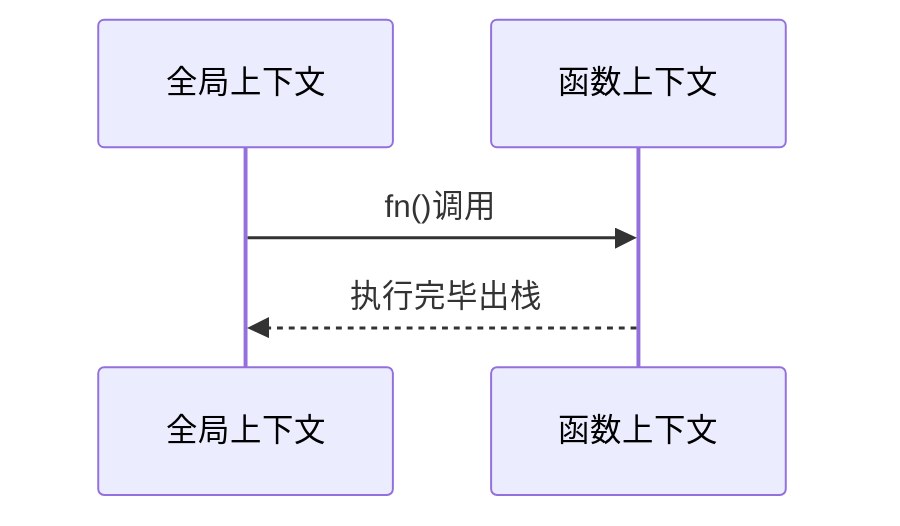
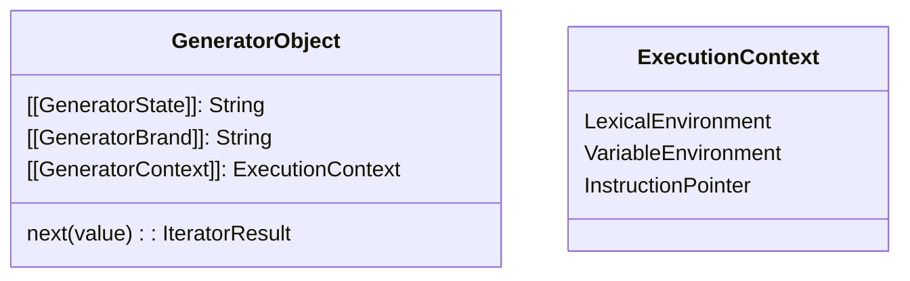
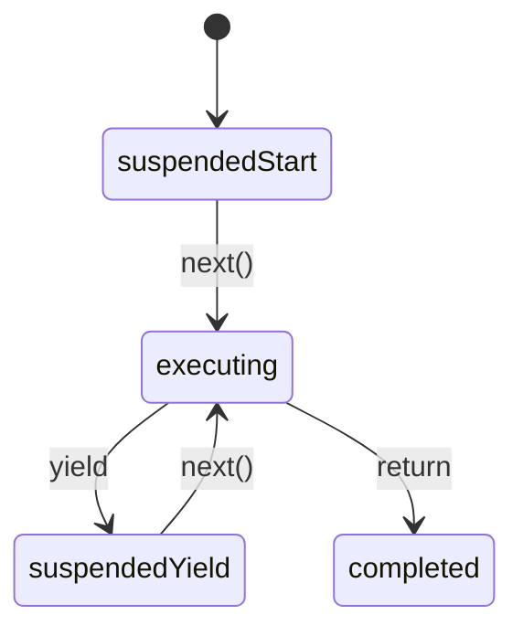
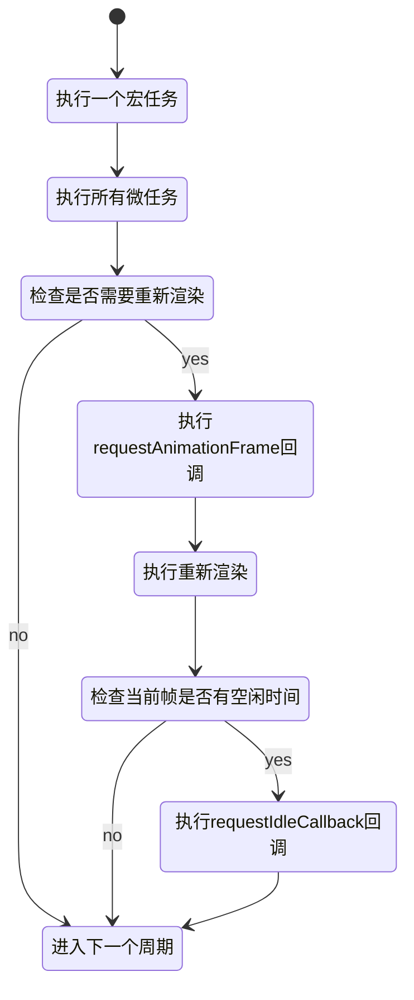

# 同步：执行栈与执行上下文
## 执行栈与执行上下文（Execution Contexts and Execution Contexts Stack）

**JavaScript 执行上下文（Execution Contexts）是 JavaScript 运行时的一种环境概念，包含当前代码运行的所有信息，执行栈（也称调用栈，全称执行上下文栈）时一种后进先出的数据结构，用于管理执行上下文，其栈顶生当前正在运行的执行上下文，两者共同配合实现 JavaScript 代码的运行。**
执行上下文有三种类型：

| 类型         | 描述                                                      |
| ---------- | ------------------------------------------------------- |
| 函数执行上下文    | 函数执行时会创建函数执行上下文，其包括参数、局部变量、this 等数据。                    |
| 全局执行上下文    | 当执行 Script 或 Module 中的代码时会创建全局执行上下文，其包括全局对象等数据，通常被压在栈底。 |
| eval 执行上下文 | eval 执行时创建 eval 执行上下文，由于安全性问题，其使用的比较少。                  |

以一个简单的 JS 代码为例：
```html
<script>
function fn(a){
  // ...
}
fn()
</script>
```
 
 JS 引擎执行上面这段代码过程：
 1. 执行到 script 时，创建全局执行上下文，并压入栈中。
 2. 执行 fn 函数时，创建函数执行上下文，压入栈中，此时函数执行上下文是栈顶，全局执行上下文是栈底。

对于大部分函数来说（有一些函数例外，如闭包、生成器函数等），当函数执行时，JS 引擎会为其创建函数执行上下文，并压入执行上下文栈中，JS 引擎会执行执行栈栈顶的执行上下文，当执行完后，栈顶执行上下文会从执行栈中出栈，并被垃圾回收。

执行上下文包括以下状态组件：
- Code evaluation state：执行、暂停和恢复与此执行上下文关联的代码的计算所需的任何状态。
- Function：如果是函数执行上下文文时，Function 字段的值是函数对象，否则值为 null。
- Realm：领域记录，这里不展开。
- ScriptOrModule：关联代码源自的 Module Record 或 Script Record。
- LexicalEnvironment：词法环境记录，保存标识符与实际值的关系。
- VariableEnvironment：变量环境记录，保存通过 var 声明的标识符与指的关系。
- PrivateEnvironment：私有环境记录，用于类的私有变量中。
## 环境记录（Environment Records）

**在执行上下文中，环境记录（Environment Records）扮演一个很重要的角色，它负责保存标识符与变量或函数实际值的关联关系**。每个环境记录都有一个 `[[outerEnv]]` 的内部属性，指向外层环境记录，如果没有外层环境记录，则为 null。
执行上下文中有三种环境记录：

| 执行上下文中的环境记录         | 描述                           |
| ------------------- | ---------------------------- |
| VariableEnvironment | 保存通过 var 声明的变量标识符与实际值之间的关联关系 |
| PrivateEnvironment  | 保存私有变量标识符与实际值之间的关联关系，通常作用于类中 |
| LexicalEnvironment  | 保存除了上面两种情况之外的标识符与实际值之间的关系    |
可以用一段代码来描述：
```javascript
function fn(a){
  var va = 1
  let b = 2
  const c = 3
}
```
在上面代码中，变量 va 保存在 `VariableEnvironment` 中，其他变量标识符保存在 `LexicalEnvironment` 中

| 环境记录                | 标识符   |
| ------------------- | ----- |
| VariableEnvironment | va    |
| LexicalEnvironment  | a、b、c |


**环境记录可以看作是作用域在运行时的表现形式：当访问一个变量时，会从当前执行上下文的环境记录中进行查找，如果没有找到，则会通过环境记录的 `[[outerEnv]]` 属性访问到外层环境记录继续查找，这种机制就是我们常说的作用域链。**

虽然所有执行上下文都有环境记录，但是实际上只有当前正在运行的执行上下文（即栈顶）中的环境记录才是“激活的”，也就是说 JS 只会直接操作栈顶执行上下文的环境记录，但是可以通过 `[[outerEnv]]` 属性访问到外层环境记录，从而访问到整个环境记录链。

## 闭包
>  有权访问另一个函数作用域中的变量的函数称为闭包 
> 									——《JavaScript 高级程序设计第三版》

前面提过：函数执行上下文入栈执行，执行完毕后出栈被 GC 垃圾回收，但是闭包比较特殊，我们以一段代码为例：
```javascript
function outerFn(){
	let a = 1
	return function innerFn(){
		console.log(a)
	}
}

const f = outerFn()
f()
```

为了方便起见，我们统一称 `outerFn` 为外层函数，`innerFn` 为内层函数。对于闭包而言，当外层函数执行完毕后，内层函数仍然可以访问外层函数中的变量。

这种现象是因为垃圾回收机制是采用"可达性"实现的，简单来说就是GC 会从一组**根**（执行上下文、DOM 跟节点、全局对象等）开始深度遍历，不能访问到的对象会被认为**死对象**从而被垃圾回收，**但是对于闭包而言，当外层函数执行完毕后，其对应的执行上下文出栈销毁，但是内层函数执行上下文中的环境记录的 `[[outerEnv]]` 仍然保存着外层函数的环境记录，这也就导致了外层函数被引用的变量仍然是"可达的"，因此不会被垃圾回收。**

我们可以手动“告知”JS 引擎，可以回收闭包中的环境记录了：
```javascript
const f = outerFn()
f()

f = null // 执行完毕后手动释放
```
## 生成器函数
另一个比较特殊的是生成器函数，生成器函数允许在函数执行过程中中断退出，并在之后重新恢复函数执行。

JS 会在生成器函数执行时创建生成器函数执行上下文，生成器函数执行上下文也属于函数执行上下文，但是会多一个 generator 内部属性指向生成器对象。

| 生成器函数执行上下文组件 | 描述               |
| ------------ | ---------------- |
| generator    | 指向该函数执行上下文的生成器对象 |

生成器函数能实现中断和恢复的核心在于**执行上下文状态的完整保存与恢复**。生成器函数执行时会创建一个生成器对象（GeneratorObject），当生成器函数执行遇到 `yield` 时，该生成器函数执行上下文从执行栈顶出栈，但是此时该执行上下文仍然会被生成器对象保存，当重新执行 `iter.next()` 时，生成器函数执行上下文重新入栈执行。

| 生成器对象组件          | 描述                                                 |
| ---------------- | -------------------------------------------------- |
| GeneratorState   | 生成器的状态                                             |
| GeneratorContext | 指向执行此生成器的执行上下文                                     |
| GeneratorBrand   | 由 ECMAScript 源文本声明的生成器的 `[[GeneratorBrand]]` 始终为空。 |
当生成器函数执行上下文（ExecutionContext）中断出栈后，生成器对象（GeneratorObject）中的 `[[GeneratorContext]]` 属性仍然保存着该执行上下文的引用，这是生成器执行上下文出栈后不会被销毁的关键原因。

此时生成器函数执行上下文的内存结构如下所示：


用一段代码来解释这一过程：

```javascript
function* fn(){
   yield 1 // 出栈，但是执行上下文不会被销毁
   yield 2 // 出栈，但是执行上下文不会被销毁
}

const iter = fn() // 创建生成器对象
iter.next() // 创建生成器函数执行上下文，入栈
iter.next() // 生成器函数执行上下文重新入栈
iter = null // 释放生成器对象，此时执行上下文将不可达，也会被垃圾回收
```




# 异步：事件循环机制
## 基于事件循环的异步机制
JavaScript 的核心设计之一是**单线程执行模型**。这意味着它只有一个主线程（调用栈）来处理代码执行。然而，许多关键操作——如网络请求 (`fetch`)、文件读写 (`fs`)、用户交互 (`click`)、定时器 (`setTimeout`) 甚至复杂的计算——在完成时都可能需要显著的时间延迟。

**如果主线程停下来 _等待_ 这些耗时操作的完成，整个程序就会陷入停滞状态，即发生“阻塞”。** 在前端，阻塞表现为页面无响应、动画卡顿、用户交互失效；在 Node.js 中，则会导致服务器无法处理其他并发请求。

为了缓解这个问题，JavaScript 设计实现了**事件循环机制**。简单来说，事件循环机制就类似一个 `while(true)` 的永不停止的一个机制，当 JS 引擎执行到异步任务时，会将其委托给宿主环境（浏览器或者 Nodejs）执行，避免阻塞主线程，当异步任务执行完毕后宿主环境再将其回调入队到对应队列（任务队列或微任务队列）中，等到主线程空闲时，将其入栈到执行栈中执行。

HTML 规范将异步任务分为宏任务和微任务，并且将存储宏任务的队列称为宏任务队列（task queue），存储微任务的队列称为微任务队列（microtask queue）。微任务优先级最高，一个事件循环周期内需要执行完所有微任务，而宏任务优先级较低，每个周期只执行一个宏任务，但是在一个周期中，宏任务执行时机早于微任务执行。

>  在 HTML 规范中将任务分为了微任务(microtask)和任务（task），而非宏任务（macrotask），但是社区常将 task 称为宏任务，本文采用社区常见叫法，将 task 称为宏任务，task queue 称为宏任务队列。


| 任务类型          | 执行者     | 优先级            | 执行时机 | 常见 API                      |
| ------------- | ------- | -------------- | ---- | --------------------------- |
| task 宏任务      | 通常是宿主环境 | 低，一个周期只执行一个宏任务 | 较早   | setTimeout、MessageChannel 等 |
| microtask 微任务 | 通常是 JS  | 高，一个周期执行完所有微任务 | 较晚   | Promise、queueMicrotask 等    |

## 浏览器中的事件循环机制
### 事件循环类型

在浏览器中，根据运行环境，可以分为三种不同类型的事件循环

| 循环类型                | 运行环境                                   | 区别            |
| ------------------- | -------------------------------------- | ------------- |
| window 事件循环（窗口事件循环） | 运行在主线程中                                | 负责渲染，可以操作 DOM |
| worker 事件循环         | 运行在 service worker、share worker 等工作线程中 | 不可以操作 DOM     |
| worklet 事件循环        | 运行在 worklet 线程中                        | 不可以操作 DOM     |
> worket 线程是一种专门用于图形和音频的工作线程，它比 web worker 线程更加轻量，通常被浏览器内部所使用。

三种事件循环机制中，窗口事件循环最为常见也最为重要，因为相较于另外两者，**窗口事件循环负责控制浏览器渲染。**

### 窗口事件循环

窗口事件循环一个周期的主要步骤如下所示：


页面的交互、动画等本质上都是由一帧帧渲染帧组成的，以 60HZ 的刷新率为例，一帧的渲染时长应当是 16.66 ms 左右，如果超过这段时间没有绘制完成渲染帧，那么就会导致“丢帧”，在页面上体现为动画卡顿、输入延迟等问题。

### 事件循环中的阻塞

在事件循环机制中，常见的造成主线程阻塞的原因有：
- **长任务**：长时间运行的同步任务，会阻塞主线程，从而阻塞渲染
- **微任务**：由于一个事件循环周期内需要执行完所有微任务，因此过多的微任务也会阻塞渲染

可以思考下，下面两种情况哪种会导致页面卡顿：

```javascript
function runMicrotask(){
    Promise.resolve().then(res=>{
        runMicrotask()
    })
}

function runMacrotask(){
 setTimeout(()=>{
     runMacrotask()
 }, 0)   
}
```

答案显然是 `runMicrotask`，而 `runMacrotask` 函数虽然会一直创建宏任务，但是由于每个周期只执行一个宏任务，因此并不会阻塞渲染。

>  题外话：执行 `runMicrotask` 后，当前标签页出现卡顿甚至卡死的情况，但是切换到另一个 tab 却发现页面正常且流程，这正好体现了我们前面章节所说的浏览器多进程架构的优异性。

事实上，如果对 `runMacrotask` 稍加改造，那么就可以实现一个简易的**时间切片**，**时间切片**常用于优化**长任务**，例如 React 18 的调度系统就采用时间切片来优化性能。

下面实现一个简单的时间切片功能：
```javascript
function runMacrotask(callback){
 let startTime = Date.now()
 let currentTime = Date.now()
 let hasTask = true
 while(currentTime - startTime < 5 && hasTask){
     currentTime = Date.now()
     hasTask = callback()
 }  
 if(hasTask){
 	 console.log('暂停执行，释放主线程')
     setTimeout(()=>runMacrotask(callback), 10)
 }
}

let i = 0
runMacrotask(()=>{
  i++
  return i<1e6
})
```

时间切片将长任务拆分成多个小任务并间隔执行，避免长时间连续地占用主线程，导致阻塞渲染。当然优化阻塞的方法有很多，比如使用 web worker，但是我们本章不关注性能优化的具体实现，而是关注于浏览器底层机制，毕竟掌握好底层原理，那么自然就能很容易找到和理解对应的优化方法。

### 空闲时间

前面我们总结了常见的阻塞渲染的因素，这些因素可能会导致浏览器无法及时地绘制渲染帧，那么如果浏览器提前绘制好了渲染帧呢？

事实上，根据 HTML 规范，浏览器会记录上一次渲染的时间，当当前周期的渲染帧绘制完成后，会将当前时间和上一次渲染的时间都差值与刷新率的渲染帧时间比较。例如上一次渲染的时间戳是 5，当前渲染完后的时间是 15，用户屏幕刷新率是 60 HZ，即渲染帧时间是 16.66 ms，那么剩余时间就有 6.66 ms（16.66 ms - （15 ms - 5 ms） = 6.66 ms）, 那么这 6.66 ms 的剩余时间就称为**空闲时间**。

如果当前周期存在空闲时间，并且执行栈、宏任务队列和微任务队列都为空，那么浏览器就会利用这段时间做一些内部，例如进行主动 GC，JS 也可以通过 `requestIdleCallback` 来利用这段时间来执行一些低优先级的任务。

## NodeJs 中的事件循环机制
###  Libuv
Nodejs 底层是基于 C++和 V8 引擎实现的，和浏览器一样，Nodejs 也是以单线程的方式执行 JS，但是 Nodejs 的事件循环机会是基于 libuv 实现的。

在 Nodejs 中，事件循环机制的异步任务是通过 libuv 的线程池来实现的，具体来说，当执行一个异步 API 时，Nodejs 会交由 libuv 线程池中的线程执行，当异步 API 执行完毕时线程池将其回调入队，等待主线程执行。

### 事件循环机制

Nodejs 的事件循环机制和浏览器中的事件循环机制有很大的不同，Nodejs 的事件循环机制分为六个阶段。

```
   ┌───────────────────────────┐
┌─>│           timers          │
│  └─────────────┬─────────────┘
│  ┌─────────────┴─────────────┐
│  │     pending callbacks     │
│  └─────────────┬─────────────┘
│  ┌─────────────┴─────────────┐
│  │       idle, prepare       │
│  └─────────────┬─────────────┘      ┌───────────────┐
│  ┌─────────────┴─────────────┐      │   incoming:   │
│  │           poll            │<─────┤  connections, │
│  └─────────────┬─────────────┘      │   data, etc.  │
│  ┌─────────────┴─────────────┐      └───────────────┘
│  │           check           │
│  └─────────────┬─────────────┘
│  ┌─────────────┴─────────────┐
└──┤      close callbacks      │
   └───────────────────────────┘

```


| 阶段               | 作用                                                                                    |
| ---------------- | ------------------------------------------------------------------------------------- |
| timers           | 执行 `setTimeout`、`setInterval()` 时间到期后的回调。                                             |
| pending callback | 执行推迟到下一次循环周期的 I/O 回调                                                                  |
| idle, prepare    | nodejs 内部使用                                                                           |
| poll             | 检索新的 I/O 事件；执行 I/O 相关回调（几乎所有回调，除了关闭回调、由定时器调度的回调和 `setImmediate()`）；node 将在适当的时候在此处阻塞。 |
| check            | 执行 `setImmediate` 的回调                                                                 |
| close callback   | 一些关闭回调，例如 `socket.on('close', ...)`                                                   |
**timers**
timers 阶段会执行定时器到达阈值的回调，需要注意的是，无论是浏览器环境还是 Nodejs 中，定时器都不是一定按照设置的阈值准时执行回调的，这主要是因为定时器回调的执行可能会被阻塞。

**pending callback**
某些系统操作的回调可能会推迟到下一次循环周期中的 pending callback 阶段执行，例如TCP 套接字错误的回调，这种方式能够让回调在稳定的环境中执行。

**poll**（轮询）
poll阶段有两个主要功能：
- 计算它应该阻塞和轮询 I/O 多长时间，然后
- 处理轮询队列中的事件。
大部分的回调都在这个阶段执行。

**check**
这个阶段专门用于执行 `setImmediate` 的回调

**process.nextTick**
`process.nextTick` 事实上优先级非常高，比 `setImmediate` 还高，`nextTick` 这个方法名具有一定的误导性，然而由于历史的原因无法修改。

`process.nextTick` 的回调不依赖事件循环机制执行，事实上，`process.nextTick` 的回调会在当前操作执行完后立即执行，无论当前处于事件循环的哪一个阶段。

### 事件循环中的阻塞
基于 Nodejs 事件循环的特性，常见的阻塞场景有：
1. 同步API 导致的主线程阻塞
2. 线程池中的线程被耗尽
3. 线程池中的线程被长时间执行

同步API（如 fs. readFileSync）会直接阻塞 Nodejs 的执行，因此通常情况下应当优先采用事件驱动的异步 API。

另外两种常见的阻塞场景是线程池被阻塞，这很好理解，线程池中的线程是有限的，如果短时间内产生大量的异步API，或者异步任务执行时间过长，那么线程池中的线程就很容易被耗尽，未被分配的异步任务就需要排队等待，从而影响 Nodejs 服务器的吞吐性能。

通过这种基于事件循环的单线程模型，Nodejs 可以很好地处理 I/O 密集型任务，但是不适合处理 CPU 密集型任务。但是优化的办法还是有的，可以通过 child_process 来创建子进程或者通过 web worker 创建工作线程的方式来优化。

# 参考
[Node.js 中文网 — 不要阻塞事件循环（或工作池）](https://nodejs.cn/en/learn/asynchronous-work/dont-block-the-event-loop)
https://html.spec.whatwg.org/multipage/parsing.html
https://tc39.es/ecma262/